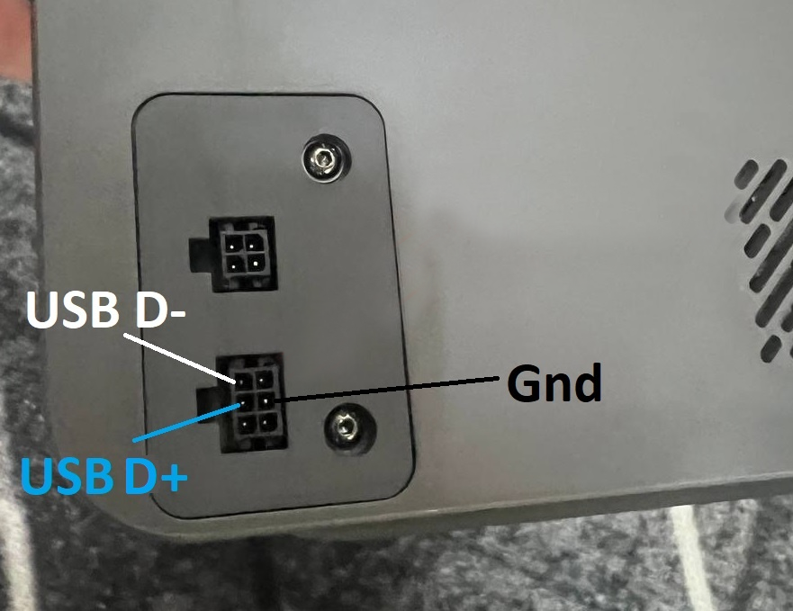

<h1 align="center">SnapACE</h1>
<p align="center">
  <a aria-label="License" href="https://github.com/BlackFrogKok/SnapAce/blob/main/LICENSE">
    
  </a>
  <a aria-label="Last commit" href="https://github.com/BlackFrogKok/SnapAce/commits/">
    
  </a>
  
</p>
<p align="center">
Этот проект обеспечивает интеграцию Anycubic ACE PRO с принтером Snapmaker U1 в роли хранилища филамента.
</p>

[English version (EN)](README.md)

## Распиновка и подключение
**Вам понадобится изготовить кабель для подключения ACE к USB**




## Инструкция по установке

1.  **Кастомная прошивка:** Установите последнюю версию [Paxx12](https://github.com/paxx12/SnapmakerU1-Extended-Firmware) кастомной прошивки для получения доступа к Snapmaker U1 по SSH.
2.  **Включение Debug-режима:**
    *   Подключитесь к принтеру по SSH.
    *   Выполните следующую команду для включения debug-режима:
        ```bash
        touch /oem/.debug
        ```
> [!NOTE]
> Этот режим позволяет пользовательским файлам сохраняться после перезагрузки.
> [!WARNING]
> Включение debug-режима сбросит настройки Wi-Fi. После перезагрузки принтера необходимо будет заново переподключиться к вашей Wi-Fi сети.
3.  **Установка дополнительных модулей:**
    *   Скопируйте `ace.py` и `filament_feed.py` из этого репозитория в папку `/home/lava/klipper/klippy/extras/` на вашем принтере.
    *   > [!IMPORTANT]
        > Переименуйте стоковый файл `filament_feed.py` в `filament_feed_stock.py` перед копированием нового.
4.  **Установка модуля кинематики:**
    *   Скопируйте `extruder.py` из этого репозитория в папку `/home/lava/klipper/klippy/kinematics/`.
> [!IMPORTANT]
> Переименуйте стоковый файл `extruder.py` в `extruder_stock.py` перед копированием нового.
5.  **Конфигурация Klipper:**
    *   Скопируйте `ace.cfg` (если он предоставлен) в папку кастомных конфигов: `/config/extended/klipper/`.
6.  **Калибровка длины подачи:**
    *   Подключите все четыре PTFE-трубки между гейтами ACE Pro и U1.
    *   Измерьте приблизительную длину PTFE-линии.
    *   Вычтите из этого значения примерно 5 см.
    *   Откройте файл `ace.cfg` и найдите переменную `feed_length:`.
    *   Введите рассчитанное значение (например, если длина линии 80 см, установите `feed_length: 750`).
    *   *Цель:* Филамент должен останавливаться примерно в 5 см от печатающей головки после подачи из гейта ACE Pro.
7.  **Перезагрузка:** Перезагрузите принтер для применения изменений.

## Пример подключения
<p>
    
    
</p>

## Поддержать проект
<p align="center"> 
  <a href="https://ko-fi.com/blackfrogkok" target="_blank">  </a> 
</p>
